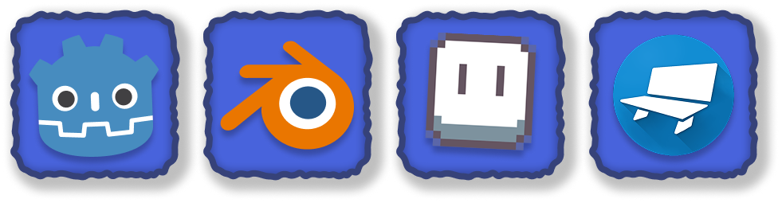

<h1 align="center">
  <strong>Heya there!</strong>
</h1>

    I'm Guilherme, aka SimplyOrtiz. 
    I'm a programmer, 2D&3D Artist. 
    I create Websites and Games. 
    Just being silly and having fun! <!-- trying to at least... -->

    
---

### Software I use! ^-^

### The boring stuff *(programming languages)*

---

<!-- I shall update this with more stuff :P -->

<!--

    

        
        
    

 -->

<!--
    🎶 Don't Forget 🎶
    
    When the light is running low and the shadows start to grow
    And the places that you know seem like fantasy
    There's a light inside your soul
    That's still shining in the cold with the truth
    The promise in our hearts
    Don't forget, I'm with you in the dark
-->

<!--
**SimplyOrtiz/SimplyOrtiz** is a ✨ _special_ ✨ repository because its `README.md` (this file) appears on your GitHub profile.

Here are some ideas to get you started:

- 🔭 I’m currently working on ...
- 🌱 I’m currently learning ...
- 👯 I’m looking to collaborate on ...
- 🤔 I’m looking for help with ...
- 💬 Ask me about ...
- 📫 How to reach me: ...
- 😄 Pronouns: ...
- ⚡ Fun fact: ...
-->
